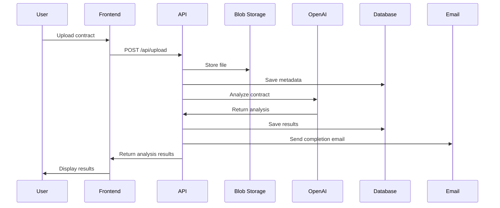
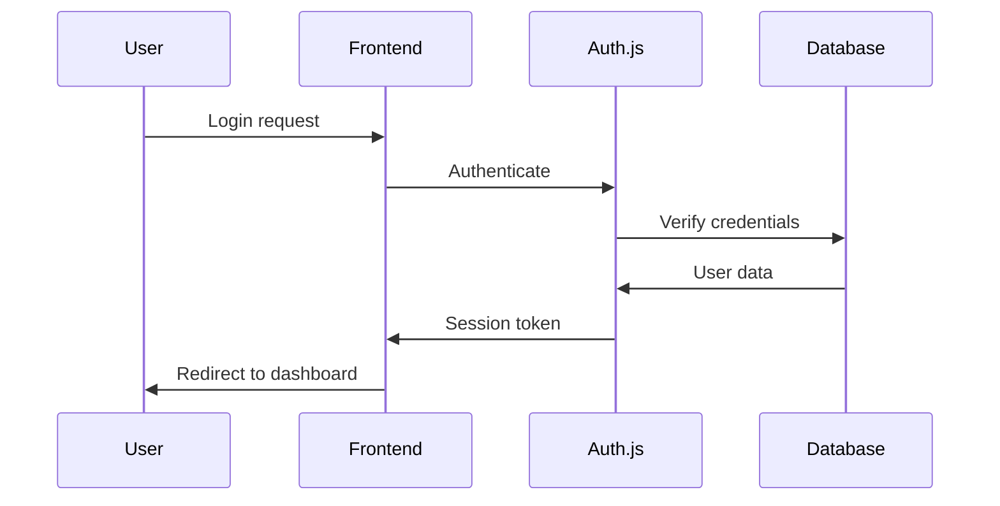

# System Architecture

## Overview

The AI-Powered Contract Review Tool is built as a modern, serverless SaaS application using Vercel's ecosystem. The architecture follows a microservices pattern with clear separation of concerns, ensuring scalability, maintainability, and developer-friendly deployment.

## High-Level Architecture

```
┌─────────────────┐    ┌─────────────────┐    ┌─────────────────┐
│   Frontend      │    │   Backend       │    │   External      │
│   (Next.js)     │◄──►│   (API Routes)  │◄──►│   Services      │
└─────────────────┘    └─────────────────┘    └─────────────────┘
         │                       │                       │
         │                       │                       │
         ▼                       ▼                       ▼
┌─────────────────┐    ┌─────────────────┐    ┌─────────────────┐
│   Vercel Blob   │    │   Neon DB       │    │   OpenAI API    │
│   (File Storage)│    │   (PostgreSQL)  │    │   (GPT-4)       │
└─────────────────┘    └─────────────────┘    └─────────────────┘
         │                       │                       │
         │                       │                       │
         ▼                       ▼                       ▼
┌─────────────────┐    ┌─────────────────┐    ┌─────────────────┐
│   Auth.js       │    │   Stripe        │    │   Resend        │
│   (Auth)        │    │   (Billing)     │    │   (Email)       │
└─────────────────┘    └─────────────────┘    └─────────────────┘
```

## Core Components

### 1. Frontend Layer (Next.js 14 App Router)

**Technology**: Next.js 14 with TypeScript and Tailwind CSS

**Key Features**:
- Server-side rendering for SEO
- Client-side navigation for SPA-like experience
- Responsive design with Tailwind CSS
- Type-safe development with TypeScript

**Structure**:
```
app/
├── (auth)/              # Authentication routes
│   ├── login/
│   ├── register/
│   └── forgot-password/
├── (dashboard)/         # Protected dashboard routes
│   ├── dashboard/
│   ├── contracts/
│   ├── analysis/
│   └── settings/
├── api/                 # API routes
├── globals.css          # Global styles
└── layout.tsx           # Root layout
```

### 2. Backend Layer (Next.js API Routes)

**Technology**: Next.js API Routes with TypeScript

**Key Features**:
- Serverless functions for scalability
- Type-safe API endpoints
- Middleware for authentication and validation
- Rate limiting and security headers

**API Structure**:
```
api/
├── auth/                # Authentication endpoints
├── contracts/           # Contract management
├── analysis/            # AI analysis endpoints
├── billing/             # Stripe webhooks
├── upload/              # File upload handling
└── webhooks/            # External service webhooks
```

### 3. Database Layer (Neon PostgreSQL)

**Technology**: Neon PostgreSQL with Prisma ORM

**Key Features**:
- Serverless PostgreSQL
- Automatic scaling
- Built-in connection pooling
- Point-in-time recovery
- Type-safe database queries
- Automatic migrations

**Schema Overview**:
```sql
-- Core tables
users                    # User accounts and profiles
organizations           # Organization/team management
subscriptions           # Stripe subscription data
contracts               # Contract metadata and analysis results
contract_files          # File storage references
analysis_results        # AI analysis outputs
usage_logs              # Usage tracking for billing
```

### 4. File Storage (Vercel Blob)

**Technology**: Vercel Blob for secure file storage

**Key Features**:
- Automatic CDN distribution
- Secure file access
- Metadata storage
- Automatic cleanup

**File Organization**:
```
contracts/
├── {userId}/
│   ├── {contractId}/
│   │   ├── original.pdf
│   │   ├── analysis.json
│   │   └── metadata.json
```

### 5. Authentication (Auth.js)

**Technology**: Auth.js (NextAuth) with multiple providers

**Providers**:
- Google OAuth
- GitHub OAuth
- Email/Password (optional)
- Magic links

**Features**:
- Session management
- Role-based access control
- Team/organization support
- Secure token handling

### 6. AI Analysis (OpenAI GPT-4)

**Technology**: OpenAI GPT-4 API

**Analysis Pipeline**:
1. **Document Processing**: Extract text from uploaded contracts
2. **Clause Extraction**: Identify key contract clauses
3. **Risk Assessment**: Flag potential risks and issues
4. **Summary Generation**: Create executive summaries
5. **Recommendations**: Provide actionable insights

**Prompt Engineering**:
- Context-aware prompts for different contract types
- Structured output formatting
- Error handling and retry logic
- Cost optimization strategies

### 7. Billing (Stripe)

**Technology**: Stripe with subscription management

**Features**:
- Subscription tiers (Free, Basic, Pro, Enterprise)
- Usage-based billing
- Webhook handling
- Invoice generation
- Payment method management

**Pricing Structure**:
- Free: 2 reviews/month
- Basic ($29/month): 10 reviews/month
- Pro ($49/month): 50 reviews/month
- Enterprise ($99/month): Unlimited reviews

### 8. Email Automation (Resend)

**Technology**: Resend for transactional emails

**Email Types**:
- Welcome emails
- Password reset
- Contract analysis completion
- Billing notifications
- Team invitations

## Data Flow

### Contract Upload and Analysis Flow



### Authentication Flow



## Security Considerations

### Data Protection
- **Encryption**: All sensitive data encrypted at rest and in transit
- **Access Control**: Role-based permissions for all resources
- **Audit Logging**: Comprehensive logging of all operations
- **GDPR Compliance**: User data handling and deletion capabilities

### API Security
- **Rate Limiting**: Prevent abuse and ensure fair usage
- **Input Validation**: Sanitize all user inputs
- **CORS**: Configured for production domains only
- **Headers**: Security headers for XSS and CSRF protection

### File Security
- **Access Control**: Signed URLs for file access
- **Scanning**: Virus scanning for uploaded files
- **Retention**: Automatic cleanup of old files
- **Backup**: Regular backups of critical data

## Scalability Considerations

### Horizontal Scaling
- **Serverless**: Automatic scaling based on demand
- **Database**: Neon's serverless PostgreSQL scales automatically
- **CDN**: Vercel Blob provides global CDN distribution
- **Caching**: Redis caching for frequently accessed data

### Performance Optimization
- **Image Optimization**: Next.js built-in image optimization
- **Code Splitting**: Automatic code splitting for faster loads
- **Database Indexing**: Optimized queries with proper indexing
- **CDN**: Global content delivery for static assets

## Monitoring and Observability

### Application Monitoring
- **Vercel Analytics**: Built-in performance and usage metrics
- **Vercel Speed Insights**: Core Web Vitals and performance monitoring
- **Error Tracking**: Optional Sentry integration for advanced error monitoring
- **Logging**: Structured logging for debugging
- **Health Checks**: API health monitoring

### Business Metrics
- **Usage Tracking**: Contract analysis volume and patterns
- **User Analytics**: User behavior and engagement
- **Revenue Tracking**: Stripe integration for billing metrics
- **Performance Metrics**: Response times and error rates

## Development Workflow

### Local Development
1. **Environment Setup**: Local environment with all services
2. **Database**: Local Neon instance or Docker PostgreSQL
3. **Testing**: Unit and integration tests
4. **Hot Reload**: Fast development iteration

### Deployment Pipeline
1. **GitHub Integration**: Automatic deployments on push
2. **Environment Management**: Separate environments for staging/production
3. **Database Migrations**: Automated schema updates
4. **Rollback Capability**: Quick rollback to previous versions

## Cost Optimization

### Infrastructure Costs
- **Serverless**: Pay only for actual usage
- **Database**: Neon's serverless pricing model
- **Storage**: Vercel Blob with automatic cleanup
- **CDN**: Included with Vercel hosting

### AI Costs
- **Prompt Optimization**: Efficient prompts to reduce token usage
- **Caching**: Cache analysis results to avoid re-processing
- **Usage Limits**: Implement usage limits per subscription tier
- **Cost Monitoring**: Track and optimize AI API usage

## Future Considerations

### Scalability Enhancements
- **Microservices**: Break down into smaller services as needed
- **Event-Driven**: Implement event sourcing for complex workflows
- **Multi-Tenancy**: Enhanced multi-tenant architecture
- **Global Deployment**: Multi-region deployment for global users

### Feature Extensions
- **API Access**: Public API for integrations
- **Webhooks**: Real-time notifications for external systems
- **Advanced AI**: Custom model training and fine-tuning
- **Mobile App**: React Native mobile application

This architecture provides a solid foundation for a scalable, maintainable, and developer-friendly SaaS application while leveraging Vercel's ecosystem for optimal performance and cost efficiency. 